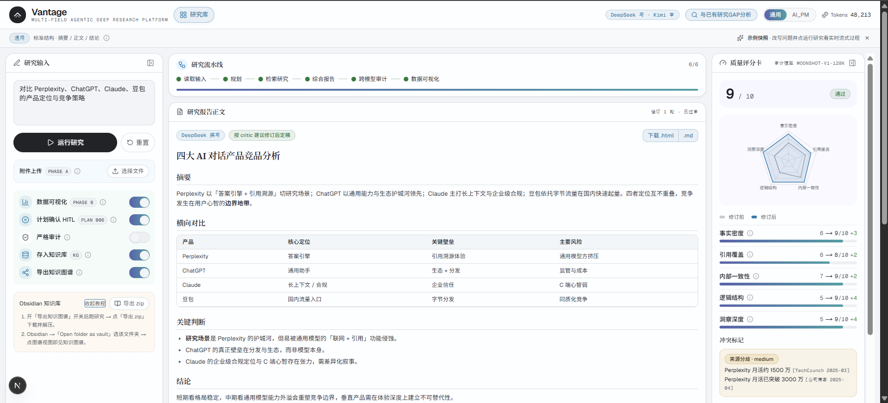
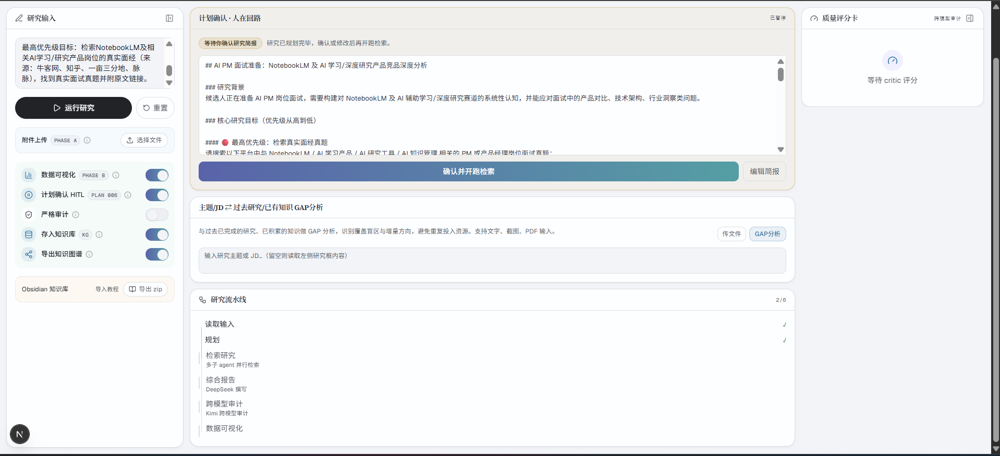
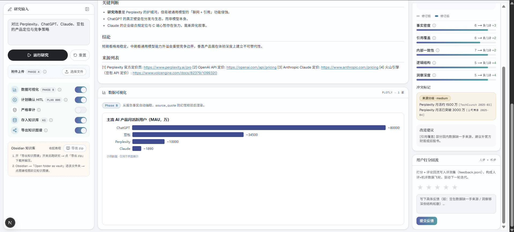
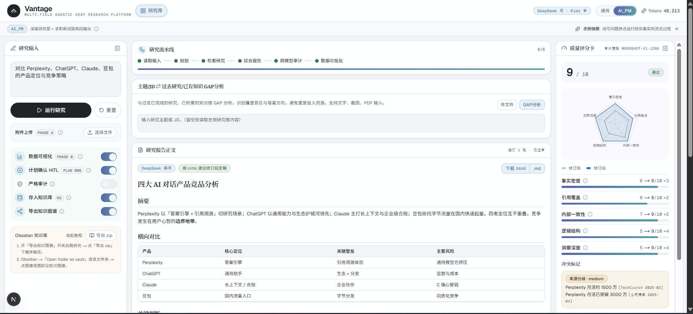
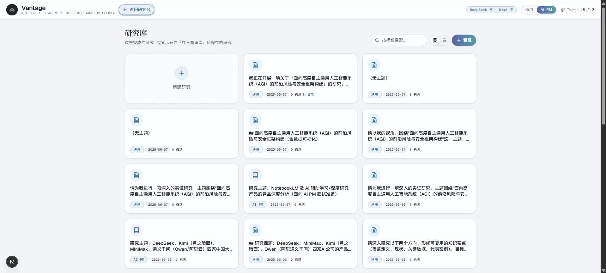
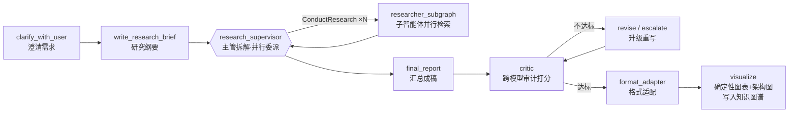

<div align="center">

# Vantage

**一个面向「深度研究」的多智能体 RAG 平台 — 不止于检索问答，而是产出可溯源、可审计、可复用的研究报告。**

**中文** · [English](README_EN.md)

<sub>计划 / 并行检索 / 跨模型审计 / 确定性可视化 / 跨会话知识图谱 · 全程 SSE 流式</sub>



</div>

---

## 这是什么

Vantage 把「深度研究」拆成一条**多智能体流水线**：澄清需求 → 写研究纲要 → 主管拆解 → 多个研究子智能体**并行检索** → 汇总成稿 → **另一个不同源的模型做审计打分** → 不达标自动**升级重写** → 适配输出格式 → **确定性生成图表与架构图**。

它解决的不是「搜一下」，而是研究流程里真正难的几件事：

- **答案能不能信？** —— 写作模型（DeepSeek）和审计模型（Kimi）**不同源**，互相不为对方背书；审计不通过自动切更强推理模型重写。
- **来源会不会被编造？** —— 引用走**白名单 + 程序化追加**，正文 `[n]` 与来源列表同序同号，即使正文被模型输出上限截断，来源也永远齐全。
- **图表会不会画错 / 画不出？** —— 模型只产**结构化数据**（ChartSpec / ArchSpec），图表和 Mermaid 架构图由**代码确定性渲染**，根治「时灵时不灵」。
- **跑过的研究能不能复用？** —— 每次研究入**知识图谱**（语义召回），新主题进来先**查重比对**，避免重复劳动，并可一键回看历史。

> 基线 fork 自 [`langchain-ai/open_deep_research`](https://github.com/langchain-ai/open_deep_research)，在其主图之上做了模式注入、跨模型审计、确定性产物、知识图谱与一套生产级前端控制室。

---

## 核心特性

### 🛰️ 实时研究控制室（SSE 流式）

研究全程以 SSE 流式推送：左侧是输入与数据源开关，中列实时滚动**研究纲要确认 → 多智能体时间线 → 报告成稿**，右侧是评分卡。整个过程可见、可中断、可回放。



### 📊 可视化 + 可溯源的研究报告

报告自带**竞品矩阵、关键数据图表（Plotly）**，每条结论后挂**可点击的来源链接**。图表数据由模型抽取为结构化 spec、再由代码渲染，确保稳定出图。



### 🔁 GAP 查重 —— 不重复跑同一个研究

新主题（或一段 JD / 能力清单）进来时，先和**历史研究**做语义查重与能力对标：命中的旧研究可直接回看 / 下载，真正的「缺口」才触发新一轮研究。



### 🗂️ NotebookLM 式历史研究库

所有研究自动归档为卡片库，支持搜索、网格 / 列表切换。点开任一条目可**原样回看**当初的研究纲要、报告、评分卡与图表三件套，并能补打分形成「人评 × 机评」数据飞轮。



---

## 架构一览



**四条设计原则**

1. **Mode 注入式** —— Planner / Format Adapter / Critic 三节点的行为由 `src/modes/*.yaml` 注入，主图零改动即可扩展新领域（首发 AI 产品研究模式，底层 mode-agnostic）。
2. **能力即工具，路由交给模型** —— 中文源（智谱）/ 面经源 / 权威源（arXiv·GitHub·官方站）都是研究智能体可自选的 tool，而非前端开关。
3. **形式产物归代码、内容决策归 LLM** —— LLM 只产结构化数据，图表 / 架构图 / 来源列表由代码确定性生成。
4. **横切层解耦** —— 工具层 / 治理层（constitution）/ 评测层 / 可观测（LangSmith）互不耦合主流程。

### 模型路由

| 职责 | 模型 | 说明 |
| --- | --- | --- |
| 写作（纲要 / 报告 / 研究） | `deepseek-chat` | 中文自然、成本低 |
| 审计 / 图表抽取 / 架构抽取 | `moonshot-v1-128k` (Kimi) | **与写作不同源 → 跨模型校验防自我背书** |
| 视觉（PDF / 截图） | `moonshot-v1-128k-vision` | 多模态输入解析 |
| 升级重写（escalation） | `deepseek-reasoner` | 审计连续不达标时切更强推理模型 |
| Embedding / 中文搜索 | 智谱 `embedding-3` + `web_search` | 语义召回与中文源检索 |

---

## 技术栈

- **编排**：LangGraph（一主图 + supervisor / researcher 两层子图）
- **后端**：FastAPI（SSE 流式 · `/jd-gap` · `/kg` · `/feedback` · `/upload` · `/export-vault`）
- **前端**：Next.js + TypeScript + Tailwind + shadcn/ui + GSAP 动效
- **检索**：Tavily（主）+ 智谱中文源 + 面经源 + 权威源
- **知识图谱**：JSON 存储 + 智谱 embedding-3 语义召回（纯 Python 余弦）+ 2-gram 回退 + Obsidian 双链导出
- **可视化**：Plotly 图表 + Mermaid 架构图（均由结构化 spec 确定性渲染）
- **可观测 / 评测**：LangSmith trace + 离线 rubric 评测集

---

## 目录结构

```
src/open_deep_research/   # 主图与核心节点
  deep_researcher.py        # 主图编排（clarify→brief→supervisor→report）
  critic.py                 # 跨模型审计 + 升级重写
  search_zh.py              # 中文源 / 面经源 / 权威源工具
  arch_diagram.py           # ArchSpec → Mermaid 确定性生成
  visualize.py              # ChartSpec → Plotly + 知识图谱落盘
  kg_store.py / embeddings.py / obsidian_export.py   # 知识图谱
  multimodal.py             # PDF / 图片多模态输入
src/modes/                # 模式配置（*.yaml + constitution + router/loader）
server/                   # FastAPI（SSE / jd-gap / kg / feedback）
frontend/                 # Next.js 控制室
tests/                    # pytest
data/eval/                # 评测查询集与报告
examples/                 # 示例研究报告输出
```

---

## 快速开始

> 环境：Python ≥ 3.10，Node ≥ 18。本仓库以 [`uv`](https://github.com/astral-sh/uv) 管理 Python 依赖。

### 1. 配置环境变量

```powershell
Copy-Item .env.example .env
# 编辑 .env，至少填入 OPENAI_API_KEY(DeepSeek) / MOONSHOT_API_KEY / ZHIPUAI_API_KEY / TAVILY_API_KEY
```

各 key 的用途见 [`.env.example`](.env.example) 内注释。

### 2. 启动后端（FastAPI + LangGraph）

```powershell
uv sync
uv run uvicorn server.app:app --reload --port 8000
```

### 3. 启动前端（Next.js 控制室）

```powershell
cd frontend
npm install
npm run dev
```

浏览器打开 `http://localhost:3000` 即可使用。

### 测试

```powershell
uv run pytest
```

---

## 评测与可观测

- **在线**：接入 LangSmith，每次运行自动上报 trace，便于回溯每个节点的输入输出与 token 消耗。
- **离线**：`data/eval/` 下维护查询集与 rubric 评测，覆盖事实性 / 引用 / 完整性等维度。

> ⚠️ 当前公开的评测指标基于早期模型基线，更换主力模型后需重跑，**不代表最终水平**。

---

## 诚实边界（这个项目「没做」什么）

为避免过度宣传，明确划清能力边界：

- **「知识图谱」** = embedding-3 语义召回（真，跨语言已验证）+ Obsidian 双链导出（真）。**不是**自建三元组图库，**不是** Postgres + pgvector（后者仅在路线图）。
- **评测** 为 25 条规模、且当前指标是早期模型基线，换模型后需重跑。
- **面经「透传」** 已做（链接全保留 + 真题抽取），但逐题深度结构化抽取仍有提升空间。
- 主力写作模型 DeepSeek 有 ~8K 输出上限的已知约束，正文可能被截断（来源列表已用程序化追加兜底）。

---

## 路线图

- [ ] 更换主力模型（Sonnet / GPT 级）以解决输出上限与审计偏宽松，并重跑评测集
- [ ] 扩展更多专业研究模式（金融 / 法律 / 医疗）
- [ ] 知识图谱升级为向量库（pgvector）与增量对比视图
- [ ] researcher 增加 `run_python` 沙箱工具（RAG → 真 Agent）

---

## 致谢与许可

- 基线 fork 自 [langchain-ai/open_deep_research](https://github.com/langchain-ai/open_deep_research)。
- 许可证：[MIT](LICENSE)。

<div align="center"><sub>这是 v1。后续迭代将持续保持此仓库链接稳定。</sub></div>
